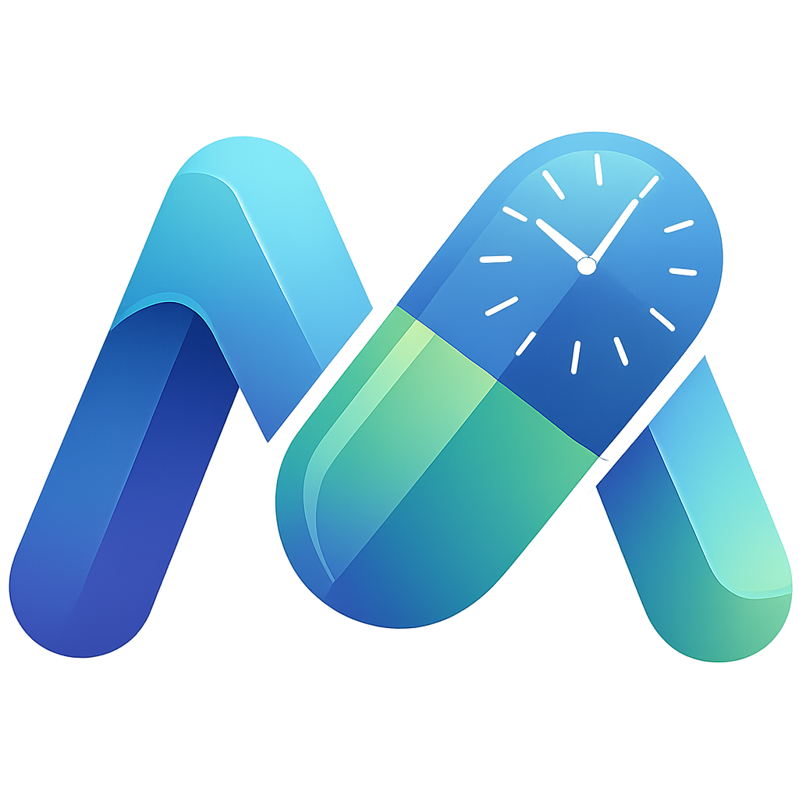

# MedTrack - Smart Medicine Dispenser 💊

<p align="center">
  
</p>

<p align="center">
  <strong>An IoT-enabled automatic medicine dispenser with mobile app control</strong>
</p>

<p align="center">
  <a href="#features">Features</a> •
  <a href="#architecture">Architecture</a> •
  <a href="#hardware">Hardware</a> •
  <a href="#installation">Installation</a> •
  <a href="#usage">Usage</a> •
  <a href="#api">API</a> •
  <a href="#contributing">Contributing</a>
</p>

---

## 📋 Overview

MedTrack is a comprehensive IoT solution designed to help patients manage their medication schedules effectively. The system combines an ESP32-based hardware dispenser with a Flutter mobile application, all synchronized through Firebase cloud services.

### The Problem

- **Medication non-adherence** affects up to 50% of patients with chronic diseases
- Elderly patients often forget their medication schedules
- Caregivers need remote monitoring capabilities
- Manual pill organizers don't provide feedback or tracking

### Our Solution

MedTrack provides:
- ⏰ **Automated dispensing** at scheduled times
- 📱 **Mobile app** for configuration and monitoring
- 🔔 **Smart notifications** with full-screen alarms
- 👨‍👩‍👧 **Multi-user support** for family/caregiver access
- 📊 **Analytics dashboard** for adherence tracking
- 🌐 **Offline operation** with local alarm storage

---

## ✨ Features

### Mobile Application (Flutter)

| Feature | Description |
|---------|-------------|
| 🔐 **Google Sign-In** | Secure OAuth 2.0 authentication |
| 📡 **BLE Provisioning** | Easy WiFi setup via Bluetooth |
| ⚙️ **Medicine Configuration** | Set names, schedules, and stock counts |
| 🔔 **Smart Alarms** | Full-screen notifications with snooze |
| 👥 **Multi-User Roles** | Owner, Secondary, Read-Only access levels |
| 📈 **Weekly Reports** | Adherence statistics and trends |
| 🔊 **Remote Buzzer** | Find your device feature |
| 🌍 **Localization** | Turkish and English support |

### IoT Device (ESP32)

| Feature | Description |
|---------|-------------|
| 🔄 **3-Section Dispenser** | Three independent medicine compartments |
| 📶 **WiFi Connectivity** | Real-time cloud synchronization |
| 💾 **Offline Mode** | NVS storage for internet outages |
| 🔊 **Audio Alerts** | Piezo buzzer melodies |
| 🔁 **Auto-Sync** | 15-second polling interval |
| 🔧 **Factory Reset** | Triple-press boot button |

---

## 🏗️ Architecture

### System Overview

```
┌─────────────────────────────────────────────────────────────────────────┐
│                         SYSTEM ARCHITECTURE                              │
└─────────────────────────────────────────────────────────────────────────┘

     ┌──────────────┐                              ┌──────────────┐
     │   User       │                              │    ESP32     │
     │   (Mobile)   │                              │   Device     │
     └──────┬───────┘                              └──────┬───────┘
            │                                             │
            │ Flutter App                                 │ WiFi
            │                                             │
            ▼                                             ▼
     ┌──────────────┐         Sync (via App)      ┌──────────────┐
     │  Firestore   │◄───────────────────────────►│    RTDB      │
     │              │                              │              │
     │ • Users      │                              │ • Config     │
     │ • Dispensers │                              │ • Buzzer     │
     │ • Logs       │                              │ • Logs       │
     └──────────────┘                              └──────────────┘
            │                                             │
            └─────────────────┬───────────────────────────┘
                              │
                              ▼
                    ┌──────────────────┐
                    │ Firebase Auth    │
                    │ (Google Sign-In) │
                    └──────────────────┘
```

### Dual Database Strategy

We use **two Firebase databases** for optimal performance:

| Database | Purpose | Used By |
|----------|---------|---------|
| **Cloud Firestore** | User profiles, device configs, detailed logs | Mobile App |
| **Realtime Database** | Real-time device sync, commands | ESP32 Device |

**Why dual databases?**
- ESP32 Firestore libraries are unstable and error-prone
- RTDB provides ~200ms latency (vs ~500ms for Firestore)
- Architectural separation between app and device layers

### Data Flow

```
WRITE FLOW:
App → Firestore → App (sync) → RTDB → ESP32

READ FLOW:  
ESP32 → RTDB → App (listener) → Firestore

BLE FLOW (Provisioning only):
Phone ←─BLE─→ ESP32 (WiFi credentials transfer)
```

---

## 🔧 Hardware

### Components

| Component | Model | Quantity | Purpose |
|-----------|-------|----------|---------|
| Microcontroller | ESP32 DevKit V1 | 1 | Main processing unit |
| Stepper Motor | 28BYJ-48 + ULN2003 | 3 | Pill dispensing mechanism |
| Speaker | Piezo Buzzer 5V | 1 | Audio alerts |
| Button | Tactile Switch | 1 | Factory reset (GPIO 0) |

### Pin Configuration

```cpp
// Motor 1 (Section 0)
#define MOTOR1_PIN1 26
#define MOTOR1_PIN2 25
#define MOTOR1_PIN3 17
#define MOTOR1_PIN4 16

// Motor 2 (Section 1)
#define MOTOR2_PIN1 27
#define MOTOR2_PIN2 14
#define MOTOR2_PIN3 4
#define MOTOR2_PIN4 13

// Motor 3 (Section 2)
#define MOTOR3_PIN1 5
#define MOTOR3_PIN2 23
#define MOTOR3_PIN3 19
#define MOTOR3_PIN4 18

// Buzzer
#define BUZZER_PIN 2
```

### 3D Model

> 📦 STL files for the dispenser enclosure are available in the `/hardware/3d-models/` directory.

---

## 📱 Mobile App Screenshots

<p align="center">
  
  
  
  
</p>

---

## 🚀 Installation

### Prerequisites

- Flutter SDK (3.0+)
- Android Studio / Xcode
- Firebase project with:
  - Authentication (Google Sign-In enabled)
  - Cloud Firestore
  - Realtime Database
- Arduino IDE or PlatformIO
- ESP32 board support

### Mobile App Setup

1. **Clone the repository**
   ```bash
   git clone https://github.com/yourusername/medtrack.git
   cd medtrack/mobile
   ```

2. **Configure Firebase**
   ```bash
   # Install FlutterFire CLI
   dart pub global activate flutterfire_cli
   
   # Configure Firebase
   flutterfire configure
   ```

3. **Install dependencies**
   ```bash
   flutter pub get
   ```

4. **Run the app**
   ```bash
   flutter run
   ```

### ESP32 Firmware Setup

1. **Open Arduino IDE** and install required libraries:
   - `Firebase ESP32 Client` by Mobizt
   - `AccelStepper`
   - `ArduinoJson`
   - `Preferences`

2. **Configure credentials** in `config.h`:
   ```cpp
   #define FIREBASE_API_KEY "your-api-key"
   #define FIREBASE_DATABASE_URL "your-database-url"
   ```

3. **Upload firmware** to ESP32

### Firebase Security Rules

**Firestore Rules:**
```javascript
rules_version = '2';
service cloud.firestore {
  match /databases/{database}/documents {
    match /users/{userId} {
      allow read, write: if request.auth != null && request.auth.uid == userId;
    }
    match /dispenser/{deviceId} {
      allow read: if request.auth != null;
      allow write: if request.auth != null && 
        (resource.data.owner_mail == request.auth.token.email ||
         resource.data.secondary_mails.hasAny([request.auth.token.email]));
    }
  }
}
```

**Realtime Database Rules:**
```json
{
  "rules": {
    "dispensers": {
      "$deviceId": {
        ".read": true,
        ".write": true
      }
    }
  }
}
```

---

## 📖 Usage

### First-Time Setup

1. **Power on the device** - LED will blink indicating BLE provisioning mode
2. **Open MedTrack app** and sign in with Google
3. **Tap "Add Device"** and scan for nearby devices
4. **Select your dispenser** (named "MEDTRACK_PROTOTYPE")
5. **Enter your WiFi credentials** - device will connect and register

### Configuring Medications

1. Tap on your device from the home screen
2. Tap on a section in the circular selector
3. Enter:
   - **Medicine name** (e.g., "Aspirin 100mg")
   - **Pill count** (current stock)
   - **Schedule times** (tap + to add times)
4. Toggle the section **Active** and save

### Understanding Alarms

When an alarm triggers:
1. **ESP32** rotates the motor to dispense the pill
2. **ESP32** plays a buzzer melody
3. **ESP32** logs the event to RTDB
4. **Mobile app** shows full-screen alarm (if enabled)
5. **User responds** "Yes" (took it) or "No" (didn't take it)
6. If "No", stock is automatically refunded

### Role-Based Access

| Permission | Owner | Secondary | Read-Only |
|------------|-------|-----------|-----------|
| View device settings | ✅ | ✅ | ✅ |
| Edit configuration | ✅ | ✅ | ❌ |
| Update stock | ✅ | ✅ | ❌ |
| Add/remove users | ✅ | ❌ | ❌ |
| View reports | ✅ | ✅ | Conditional* |

*Read-only users can view reports only if the owner enables feedback sharing.

---

## 📡 API Reference

### RTDB Structure

```json
{
  "dispensers": {
    "{MAC_ADDRESS}": {
      "buzzer": false,
      "debug_status": "ONLINE",
      "presence": true,
      "verification_required": false,
      "last_verification": {
        "timestamp": 1704357600,
        "score": 0.95,
        "status": "verified"
      },
      "config": {
        "section_0": {
          "name": "Aspirin 100mg",
          "isActive": true,
          "pillCount": 15,
          "schedule": [
            {"h": 8, "m": 0},
            {"h": 20, "m": 0}
          ]
        },
        "section_1": { ... },
        "section_2": { ... }
      },
      "logs": {
        "{pushId}": {
          "type": "auto_dispense",
          "section": 0,
          "timestamp": 1704357600
        }
      }
    }
  }
}
```

### Firestore Collections

**users/{userId}**
```json
{
  "email": "user@example.com",
  "displayName": "John Doe",
  "owned_dispensers": ["AA:BB:CC:DD:EE:FF"],
  "secondary_dispensers": [],
  "read_only_dispensers": [],
  "device_groups": [
    {"id": "123", "name": "Bedroom", "devices": ["AA:BB:CC:DD:EE:FF"]}
  ]
}
```

**dispenser/{macAddress}**
```json
{
  "owner_mail": "owner@example.com",
  "secondary_mails": ["helper@example.com"],
  "read_only_mails": ["family@example.com"],
  "device_name": "Mom's Dispenser",
  "section_config": [...]
}
```

### BLE Protocol

| UUID | Type | Description |
|------|------|-------------|
| `4fafc201-1fb5-459e-8fcc-c5c9c331914b` | Service | Main BLE service |
| `beb5483e-36e1-4688-b7f5-ea07361b26a8` | Characteristic | WiFi credential transfer |

**Provisioning Payload:**
```json
{"s": "WiFi_SSID", "p": "WiFi_Password"}
```

**Response Values:**
- `TRYING` - Attempting connection
- `SUCCESS` - Connected successfully
- `FAIL` - Connection failed

---

## 🧪 Testing

### Unit Tests
```bash
cd mobile
flutter test
```

### Integration Tests
```bash
flutter test integration_test/
```

### Hardware Testing

1. **Motor Test**: Each motor should rotate 90° (1024 steps)
2. **Buzzer Test**: Melody should play on startup
3. **WiFi Test**: Check serial monitor for connection status
4. **NVS Test**: Power cycle and verify alarm persistence

---

## 🛠️ Troubleshooting

### Device won't connect to WiFi
- Ensure 2.4GHz network (ESP32 doesn't support 5GHz)
- Check password accuracy
- Try factory reset (3x boot button press)

### Alarms not triggering
- Verify NTP time sync in serial monitor
- Check if section is marked as "Active"
- Ensure pillCount > 0

### App not receiving updates
- Check internet connection
- Verify Firebase project configuration
- Check Firestore security rules

### BLE device not found
- Ensure Bluetooth is enabled on phone
- Check location permissions (required for BLE on Android)
- Device must be in provisioning mode (no WiFi configured)

---

## 🗺️ Roadmap

- [ ] **v1.1** - iOS app release
- [ ] **v1.2** - Voice assistant integration (Google Home / Alexa)
- [ ] **v1.3** - Custom audio file support (DFPlayer Mini)
- [ ] **v1.4** - Medication interaction warnings
- [ ] **v2.0** - Cloud-based prescription management
- [ ] **v2.1** - Healthcare provider dashboard

---


### Code Style

- **Flutter**: Follow [Effective Dart](https://dart.dev/guides/language/effective-dart)
- **C++**: Use Arduino style guidelines
- **Commits**: Use [Conventional Commits](https://www.conventionalcommits.org/)

---

## 📄 License

This project is licensed under the MIT License - see the [LICENSE (In progress...)](LICENSE) file for details.

---

## 👥 Team

| Name            | Role                         | Contact                                 |
|-----------------|------------------------------|-----------------------------------------|
| Efe Serin       | Mobile App Developer         | [@github](https://github.com/efesrnn)   |
| Emirhan Köksal  | Mobile App Developer         | [@github](https://github.com/koksal100) |
| Toprak Pusatlı  | Hardware Planning & Design   | |
| Yağız Alp Şener | Hardware Planning & Design   | |
| Doğa Lal ÇELİK  | Product Testing and Analysis | |
| Buse ATABAY     | Product Testing and Analysis | |
---

## 🙏 Acknowledgments

- [Firebase](https://firebase.google.com/) - Backend infrastructure
- [Flutter](https://flutter.dev/) - Cross-platform framework
- [AccelStepper](https://www.airspayce.com/mikem/arduino/AccelStepper/) - Motor control library
- [Mobizt Firebase Library](https://github.com/mobizt/Firebase-ESP32) - ESP32 Firebase client

---


<p align="center">
  <a href="https://github.com/koksal100/medTrackPlus/stargazers">⭐ Star us on GitHub!</a>
</p>
